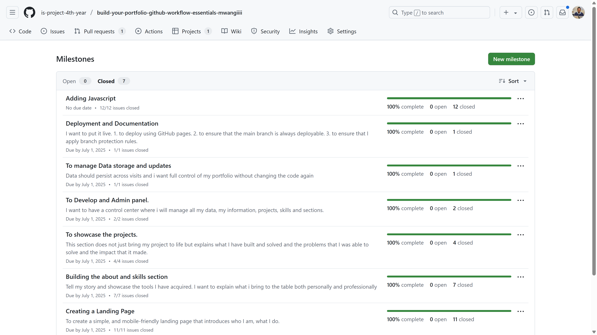

# Personal Portfolio Documentation

## 1. Student Details

- **Full Name**: Wanjiku Dennis Mwangi
- **Admission Number**: 151354
- **GitHub Username**: mwangiiii
- **Email**: dennis.wanjiku@strathmore.edu

## 2. Deployed Portfolio Link

- **GitHub Pages URL**:  
 [ _(Link to portfolio)_](https://is-project-4th-year.github.io/build-your-portfolio-github-workflow-essentials-mwangiiii/)

## 3. Learnings from the Git Crash Program

--- 

**1. Concept: Git Is Just Online Backup**
-    Expectation 👀: I thought Git was basically a fancier Google Drive for code just push it up and you're done.
-    Reality 😅: Git actually tracks every version of your code and helps you experiment safely without messing up your main work.
-    Impact 💡: I used branches for each section of my portfolio (like Projects and Skills) and kept everything clean and organized.

---

**2. Concept: Merging Is Always Smooth**
-    Expectation 👀: I assumed merging was quick and automatic—no extra work needed.
-    Reality 😅: I ran into merge conflicts and had to learn how to fix them by choosing what code to keep.
-    Impact 💡: Now I commit often and review changes before merging. It kept my portfolio stable and bug-free.

---

**3. Concept: GitHub Issues & Boards Are Only for Teams**
-    Expectation 👀: I figured those tools were for big teams with complex workflows.
-    Reality 😅: Turns out they’re great for solo projects too! Breaking tasks into issues made the project more manageable.
-    Impact 💡: I tracked each feature (like Admin Panel or Home Page) as an issue with its own branch. It gave my work structure and momentum.

---

**4. Concept: Commit Messages Don’t Matter Much**
Expectation 👀: I used to think “update” or “fix” was enough for commit messages.
Reality 😅: Clear commit messages helped me understand what I changed and when, especially after a few days away.
Impact 💡: Now I write messages like feat: add skills section it makes my Git history easy to follow.

--- 

## 4. Screenshots of Key GitHub Features

Include screenshots that demonstrate how you used GitHub to manage your project. For each screenshot, write a short caption explaining what it shows.

> Upload the screenshots to your GitHub repository and reference them here using Markdown image syntax:
> (you could just simply copy and paste the image into the Assignment.md)

```markdown

```

### A. Milestones and Issues


_A screenshot showing all milestones and the number of closed/open issues._


_Linked issues for JavaScript development._


_Issues and progress for site deployment and branch protection._


_Data persistence milestone with linked localStorage issue._


_Issues showing CRUD setup for managing portfolio data._


_Project section milestone with issues linked to layout and data rendering._


_About Me and Skills sections milestone with completed issues._


_Minimal footer milestone and issue closure._

